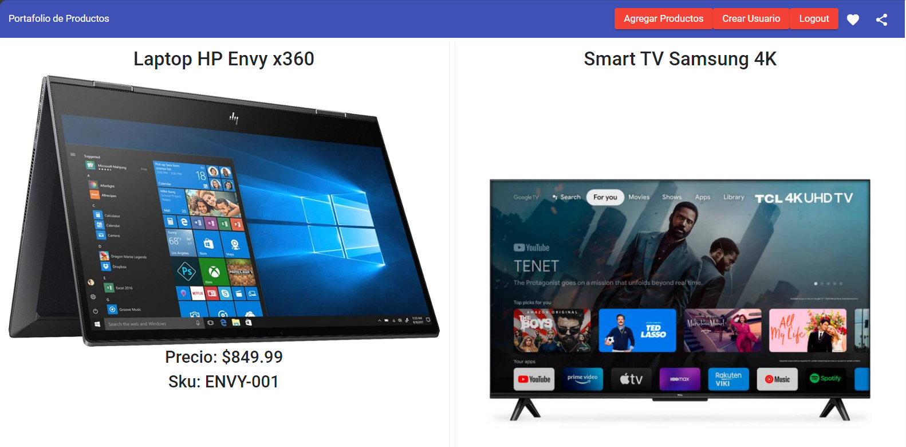
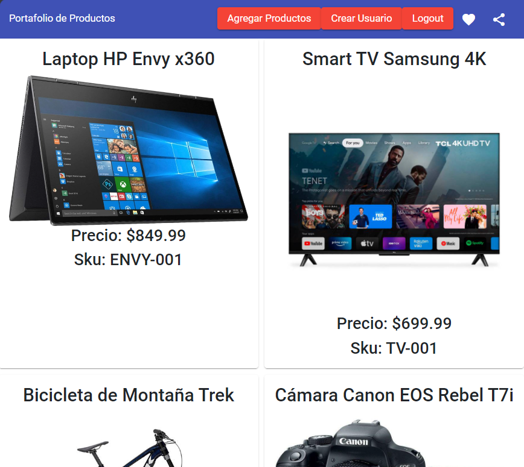
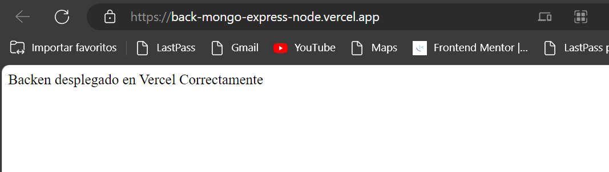

# CRUD-MONGODB-NODEJS-ANGULAR

This is a proyect to improve my coding skills. 

## Table of contents

- [Overview](#overview)
  - [The challenge](#the-challenge)
  - [Screenshot](#screenshot)
  - [Links](#links)
- [My process](#my-process)
  - [Built with](#built-with)
  - [What I learned](#what-i-learned)
  - [Continued development](#continued-development)
  - [Useful resources](#useful-resources)
- [Author](#author)
- [Acknowledgments](#acknowledgments)

### The challenge

In this project the challenge was to build a product catalog, where products can be listed and filtered through a search engine. The system should allow to create new products and display them in the list, also it should allow to edit and delete a previously created product.

### Screenshots

### Links

- Solution URL: [Github Repository ](https://github.com/RobARC/CRUD-MONGODB-NODEJS-ANGULAR)
- Live Site URL: [Deployed in Vercel](https://back-mongo-express-node.vercel.app//)

### Desktop View

### Backend Deployed View

## My process

### Built with STACK MEAN

- Data Base Mongo DB Compass v1.40.2
- Backend Express 4.18.2
- Angular 15
- Node 18.12.1
- Semantic HTML5 markup
- CSS custom properties
- Angular material
- Bootstrap 5
- Mobile-first workflow
- [Angular](https://angular.io//) - Angular Framework

### Other Libraries Backendside

- body-parser v1.20.2
- cors v2.8.5
- dotenv v16.3.1
- express v4.18.2
- jsonwebtoken v9.0.2
- mongodb v6.1.0
- mongoose v7.5.3

### Other Libraries Frontendside

- ngx-cookie-service v15.0.0
- ngx-pagination v6.0.3
- ngx-pipes v3.2.2
- rxjs  v7.8.0

### Useful resources

- [MongoDB](https://www.mongodb.com/docs/) - a No Relational Database
- [NPM](https://www.npmjs.com/) - JavaScript Libraries.

- [Express](https://expressjs.com/) - Express Documentation.

- [Angular](https://angular.io/) - My favorite framework.

- [Angular University](https://angular-university.io/) - Courses for All Levels Videos and E-Books.

## Author

- Website - [Roberth Rondón](https://robarc.github.io/)
- Twitter - [@rrondonc](https://twitter.com/rrondonc)

## Acknowledgments

To Almighty God! for Computers and Software and the team of https://www.rocketfy.co/